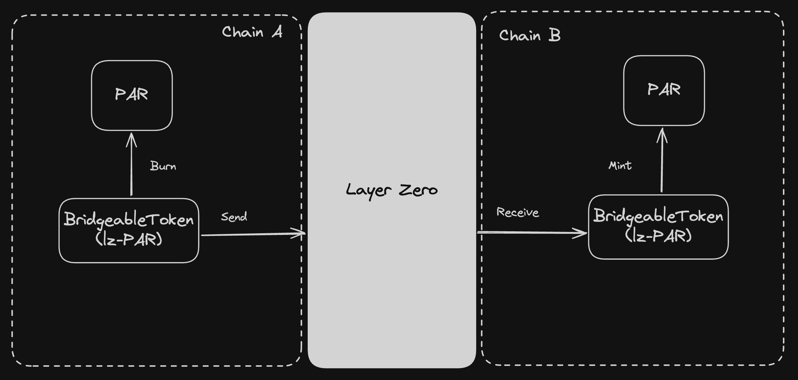
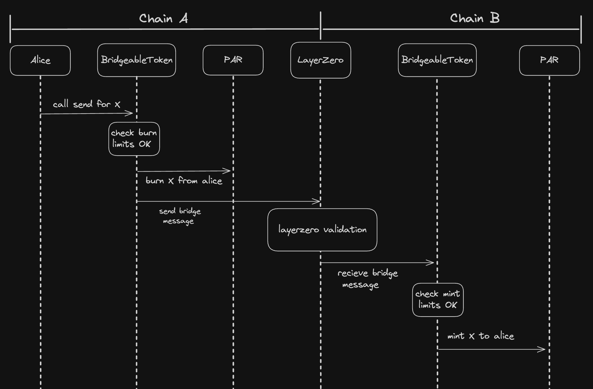
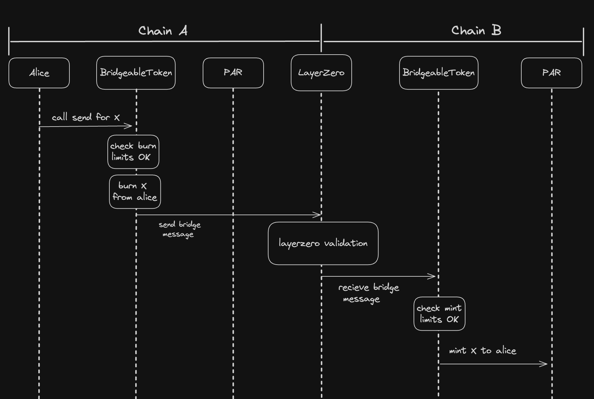
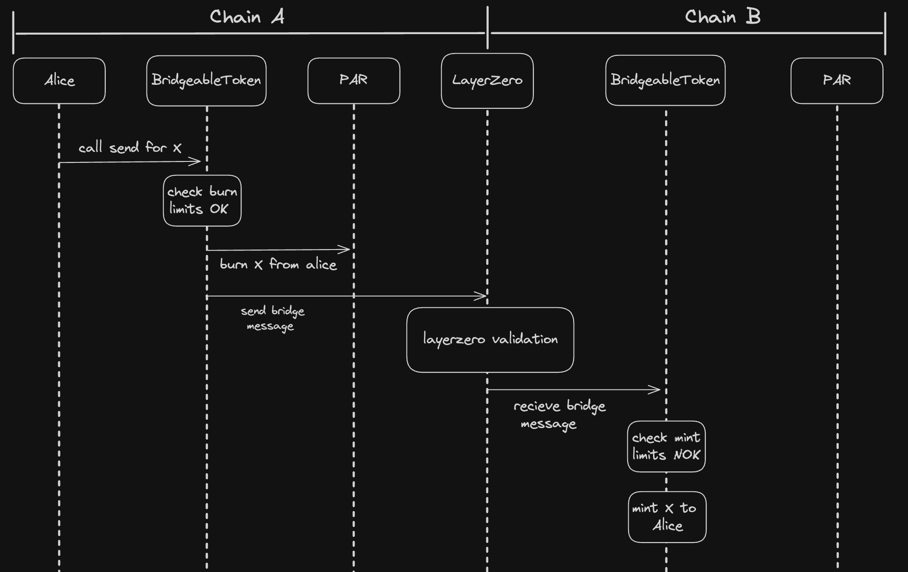

# BridgeableToken

## Overview

[BridgeableToken.sol](contracts/BridgeableToken.sol) allows an already deployed ERC-20 token to be bridgeable by leveraging [LayerZero's OFT standard](https://docs.layerzero.network/v2/home/protocol/contract-standards#oft).

## Key Features

The key features of `BridgeableToken` are:

- Ability to burn principal tokens (named `XXX`) and send a message to LayerZero to mint the mirrored token on the other chain.
- Ability to mint principal tokens by receiving a message from LayerZero from the mirrored BridgeableToken contract on the other chain.
- Ability to cap the principal token amount to mint and burn (per day and globally). Since minting tokens from a received message must not revert, when the mint limit is reached, the user will receive OFT tokens (named `lz-XXX`) instead of principal tokens.
- Ability to swap OFT tokens to principal tokens if the limits are not reached.

### High level Design :

## Technical Details

### LayerZero OFT standard

The OFT standard from LayerZero allows fungible tokens to be transferred across multiple blockchains without asset wrapping or middlechains. The BridgeableToken contract is designed to comply with this standard to mint/burn the OFT tokens if the mint/burn limit is reached. More details about the OFT standard can be found [here](https://docs.layerzero.network/v2/home/protocol/contract-standards#oft).

### Why do we need an OFT token ?

When the contract receives a message from LayerZero to mint principal tokens on its chain, it must not revert. Due to the mint limit on the principal token, we still have to credit the user with something. This is why we mint OFT tokens instead of principal tokens XXX. The user can then swap these OFT tokens for principal tokens if the limit is not reached.

### Receiving Credit Messages from LayerZero

When the contract receives a message from LayerZero, it will mint tokens to the specified receiver address. Depending on the mint limits, the receiver will be credited with principal tokens and/or OFT tokens.

### Sending Messages to LayerZero

Users can send principal tokens or OFT tokens to a receiver address on another chain by calling the `send` function. A check regarding burn limits and isIsolateMode is performed before sending the message to LayerZero. If any check fails, the function will revert. The user's tokens will be burned before sending the message to LayerZero.

### Swap OFT tokens to principal tokens

As users can receive OFT tokens instead of principal tokens when one of the mint limit is reached, the contract provides a `swapLzTokenToPrincipalToken` function to swap these OFT tokens for principal tokens according to the limits.

### Pause

A `pause` function exists to prevent new send() calls from being executed. This is useful in the event of a bug or security vulnerability.

Only the **Owner** may call pause

### Unpause

An `unpause` function exists to unpaused the contract.

Only the **Owner** may call unpause

### IsolateMode

A `toggleIsolateMode` function exists to toggle the `isIsolateMode` variable.
This variable is used to prevent the contract to burn more principal token than what it has minted. This is useful when the contract is in a state where it has minted more principal tokens than it has burned.

Only the **Owner** may call toggleIsolateMode

### Principal token mint/burn limits

Daily and global mint/burn limits on the principal token:

- `dailyMintLimit` : Maximum amount of principal tokens that can be minted in a day.
- `dailyBurnLimit` : Maximum amount of principal tokens that can be burned in a day.
- `globalMintLimit` : Maximum amount of principal tokens that can be minted globally.
- `globalBurnLimit` : Maximum amount of principal tokens that can be burned globally.

When a burn limit is reached, the contract will simply revert future send requests for principal tokens. When a mint limit is reached, the contract will mint OFT tokens instead of principal tokens.

Only the **Owner** may set the daily and global mint/burn limits.

## Sample use cases

### User scenario 1:

In this scenario, no limit is reached, and the user sends principal tokens. The user wants to send 100 principal tokens to another chain. The contract will burn 100 principal tokens and send a message to LayerZero to mint 100 principal tokens on the other chain.

### User scenario 2:

In this scenario, no limit is reached, but the user sends OFT tokens. The user wants to send 100 OFT tokens to another chain. The contract will burn 100 OFT tokens and send a message to LayerZero to mint 100 principal tokens on the other chain.

### User scenario 3:

In this scenario, a mint limit is reached. The user wants to send 100 principal tokens XXX to another chain. The contract will burn 100 principal tokens XXX and send a message to LayerZero to mint 100 principal tokens XXX, but as the mint limit is reached, the user will receive OFT tokens lz-XXX on the other chain.

## Deployment

Check the [DeployedAddresses.md](./DeployedAddresses.md) file for the deployed addresses on different networks.

## Documentation for audit

For more details on the contract, refer to the [Audit details](./AuditDetails.md).
